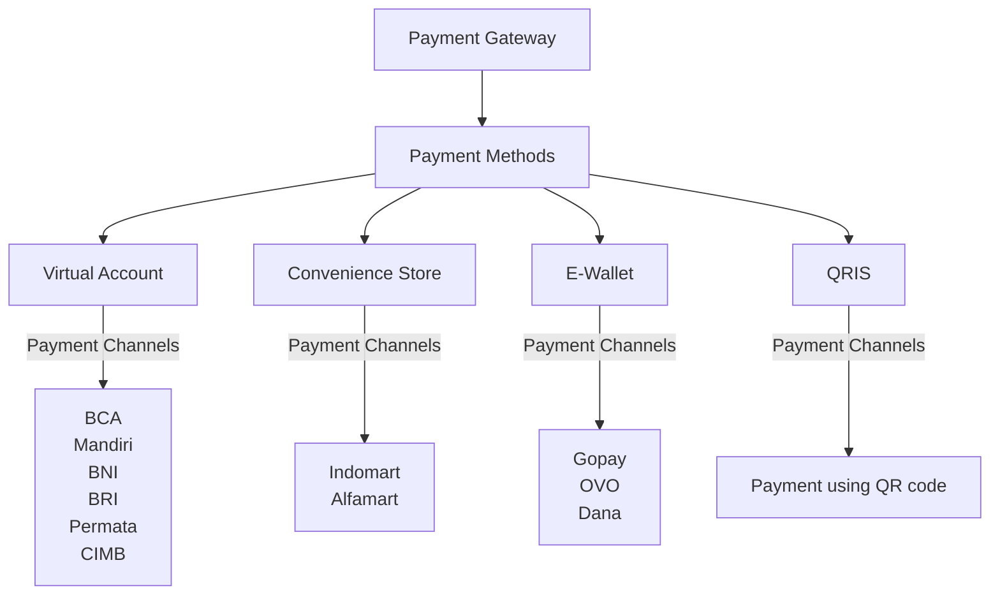

# GetPay

GetPay adalah layanan gratis untuk menangani pembayaran dari beberapa payment gateway yg mendukung mata uang indonesia (IDR).

Saat ini kami hanya mendukung payment gateway dari:

- [x] [IPaymu](https://ipaymu.com)
- [x] [Xendit](https://xendit.co)
- [x] [DuitKu](https://duitku.com)

Proyek ini dibuat menggunakan:

* [FastAPI](https://fastapi.tiangolo.com/)
* [MongoDB](https://www.mongodb.com/)
* [Popol](https://github.com/aprilahijriyan/popol)

Untuk lebih rinci tentang daftar ketergantungan dari proyek ini, silahkan lihat [Pipfile](https://github.com/getpay-id/getpay-api/blob/main/Pipfile#L6)

## Features

### Multiple Payment Gateway

Kami menyediakan API untuk membuat transaksi dengan metode pembayaran yang didukung oleh payment gateway dengan format request yang sama (_berlaku di semua payment gateway_).

### Intuitive Payment Method Mapping

Kami telah memetakan metode pembayaran yang di dukung oleh payment gateway, seperti:

* **Virtual Account**
* **Convenience Store**
* **E-Wallet**
* **QRIS**

Berikut ini flow chart sebagai gambaran bagaimana proses pemetaan metode pembayaran yang dilakukan oleh GetPay:

Pemetaan ini berlaku untuk semua payment gateway.

### Payment Callback

Kami juga sudah menyediakan API untuk menerima callback (status payment) dari payment gateway.

### API Keys

Kami menyediakan API Key untuk mengakses Getpay API. Tujuan dari API Key ini adalah untuk mengimplementasikan integrasi antara GetPay API dan Service lain.

### Websocket

Kami juga menyediakan websocket untuk mendapatkan status transaksi secara real time.

### Dashboard

Saat ini kami sedang membuat dashboard untuk mengelola:

* Payment Gateway
* Payment Method
* Payment Channel
* API Keys
* Media Files
* Dan masih banyak lagi.

Untuk lebih rinci, silahkan lihat https://getpay.id/dashboard.

Untuk repository dashboard juga bisa dilihat di https://github.com/getpay-id/dashboard

## Documentation

Lihat disini: https://github.com/getpay-id/getpay-api/wiki

Atau

[Lihat GetPay Workspace di Postman](https://www.postman.com/powerranger/workspace/getpay-api)

## Support & Donate

Jika proyek ini bermanfaat, kamu bisa berikan donasi melalui:

* [Trakteer](https://trakteer.id/apriladev/tip)
* [PayPal](https://paypal.me/aprilahijriyan)
* **BTC**: bc1qxqyxchp3tem47uavwv0ljqr4nx3gggurwahqr0
* **ETH**: 0xA51831F3f27D9f790d52305c19E79CD7F3226CFd
